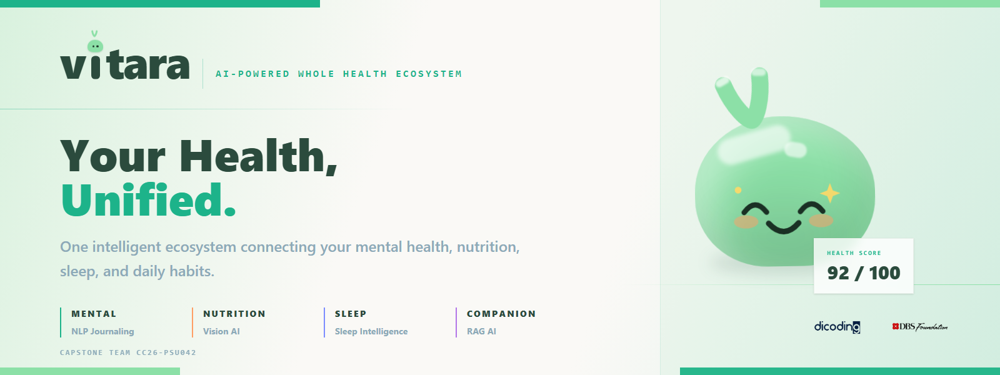

<p align="center">
  
</p>

# Vitara - Ekosistem Kesehatan Holistik Berbasis AI

Vitara adalah ekosistem kesehatan holistik berbasis AI yang membantu pengguna
memahami dan memantau kesehatan mental, nutrisi, tidur, serta kebiasaan harian
dalam satu aplikasi. Repositori ini menyatukan seluruh layanan Vitara untuk
kebutuhan pengembangan dan pengumpulan proyek.

> Vitara merupakan alat pendamping kebiasaan sehat, bukan pengganti diagnosis
> atau konsultasi tenaga medis profesional.

## Fitur Utama

- **Kesehatan mental**: analisis emosi dan tingkat stres melalui jurnal.
- **Nutrisi**: pencatatan makanan dan klasifikasi foto makanan menggunakan AI.
- **Tidur**: pencatatan serta analisis kualitas dan pola tidur.
- **Stress radar**: estimasi tingkat stres berdasarkan dinamika mengetik.
- **Health score**: ringkasan kondisi kesehatan pengguna secara menyeluruh.
- **Vee companion**: asisten kesehatan berbasis AI dengan respons streaming.
- **Data science pipeline**: pengumpulan data, preprocessing, EDA, feature
  engineering, balancing, validasi, dan persiapan A/B testing.
- **Dashboard analitik**: eksplorasi dan visualisasi dataset Vitara.

## Struktur Repositori

| Direktori | Keterangan | Teknologi Utama |
| --- | --- | --- |
| [`frontend/`](./frontend) | Progressive Web App yang digunakan oleh pengguna Vitara | React, TypeScript, Vite, Tailwind CSS |
| [`backend/`](./backend) | API gateway, autentikasi, penyimpanan data, dan orkestrasi layanan | Bun, Express, TypeScript, Supabase |
| [`data-science/`](./data-science) | Workspace pengolahan dataset, preprocessing, EDA, validasi data, dan dokumentasi teknis | Python, Pandas, NumPy, Jupyter Notebook |
| [`ai-service/`](./ai-service) | Model machine learning dan API inferensi Vitara | Python, FastAPI, TensorFlow, ONNX |
| [`dashboard/`](./dashboard) | Dashboard analitik untuk mengeksplorasi dataset Vitara | Python, Streamlit, Pandas, Plotly |

Setiap layanan memiliki dokumentasi, dependensi, dan cara menjalankan masing-masing.

## Arsitektur Singkat

```text
Pengguna
   |
   v
Frontend PWA
   |
   v
Backend Gateway ------> Supabase
   |
   v
AI Service

Data Science Pipeline ---> Dataset Vitara ---> AI Service
Dashboard Analitik ------> Dataset Vitara
```

## Cara Menjalankan

Karena Vitara menggunakan beberapa layanan terpisah, setiap layanan perlu
disiapkan dan dijalankan secara mandiri.

1. Siapkan database dan jalankan [`backend`](./backend/README.md).
2. Gunakan [`data-science`](./data-science/README.md) jika perlu mereplikasi
   preprocessing, EDA, validasi, atau persiapan dataset.
3. Jalankan [`ai-service`](./ai-service/README.md).
4. Jalankan [`frontend`](./frontend/README.md).
5. Jalankan [`dashboard`](./dashboard/README.md) untuk mengeksplorasi dataset.

Ikuti petunjuk pada README di setiap direktori untuk mengetahui prasyarat,
konfigurasi environment, dan perintah yang dibutuhkan.

## Repositori Asli

Riwayat commit dan pengembangan masing-masing layanan dapat dilihat melalui
organisasi GitHub [Vitara-hub](https://github.com/Vitara-hub).
